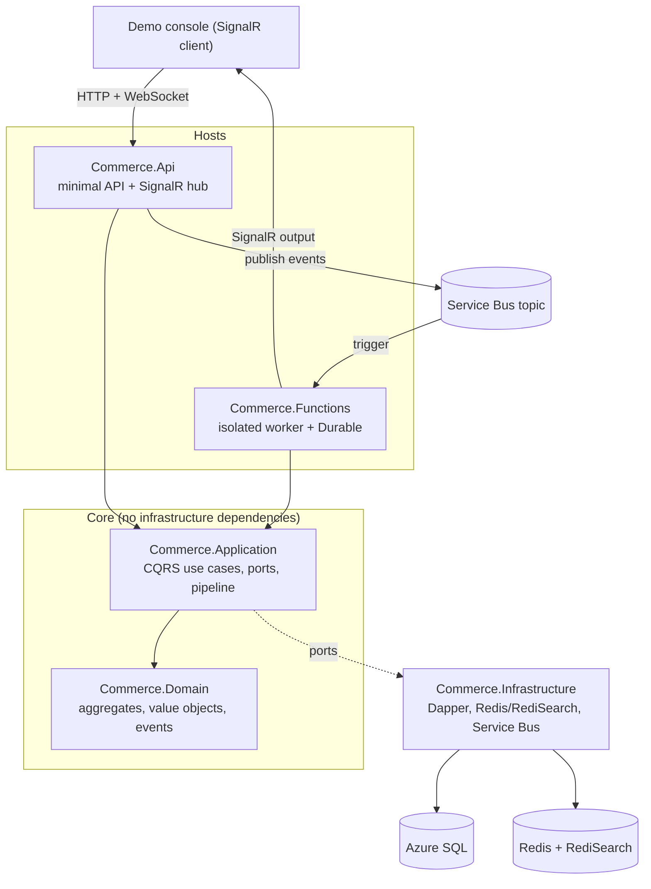

# Commerce Catalog

A reference backend for an e-commerce product catalog and PIM, built on .NET 10 and Azure. It is a small but complete vertical slice that shows how I structure a service: Clean Architecture, Dapper over SQL (no EF Core), Azure Cache for Redis with RediSearch, Azure Service Bus, an Azure Functions isolated worker with Durable Functions, and SignalR for realtime updates. It ships with unit, integration, and UI tests, CI, and a one command demo.

[](https://github.com/gpavlovych/commerce-catalog-sample/actions/workflows/ci.yml)
[](https://codecov.io/gh/gpavlovych/commerce-catalog-sample)
[](https://dotnet.microsoft.com/)
[](LICENSE)
[](https://gpavlovych.github.io/commerce-catalog-sample/)

> Live console (GitHub Pages): https://gpavlovych.github.io/commerce-catalog-sample/ — Pages hosts the static console only, so set the API base box (top right) to a deployed API to make it load data. For a single-origin demo that also serves the API and the `/scalar` reference, deploy the container to Azure Container Apps or Render (see [docs/deployment.md](docs/deployment.md)).

## Why this exists

The interesting part of a catalog service is not the CRUD. It is the boundaries: keeping the domain free of infrastructure, making data access fast and explicit, keeping search off the relational database, and processing events without double counting when the broker redelivers. This repo is organised so those decisions are visible and tested rather than buried.

## Architecture



The dependency rule points inward. `Domain` depends on nothing. `Application` depends only on `Domain` and defines ports (interfaces) for everything it needs from the outside world. `Infrastructure` and the two host projects depend on the inner layers and implement those ports. Full write up in [docs/architecture.md](docs/architecture.md).

## How it maps to the stack

| Requirement | Where it lives |
| --- | --- |
| .NET 10, C# | All projects target `net10.0` |
| Dapper over Azure SQL, no EF Core | `Infrastructure/Persistence`, hand written T-SQL in `SqlScripts.cs` |
| Strong T-SQL | Explicit column lists, parameterised queries, version 7 GUID keys |
| Azure Cache for Redis, RediSearch | `Caching/RedisCacheService`, `Persistence/RediSearchProductIndex` |
| Azure Service Bus | `Messaging/ServiceBusEventPublisher`, MessageId based dedup |
| Azure Functions, isolated worker | `Commerce.Functions` |
| Durable Functions | `Functions/Forecasting`, timer start plus fan out and fan in |
| SignalR | `Api/Realtime/PriceHub`, and a SignalR output binding in the worker |
| Clean Architecture | Project layering and the enforced dependency rule |
| Testing (unit, integration, UI) | `tests/Commerce.UnitTests`, `IntegrationTests`, `UiTests` |

## Quick start

The fastest path runs with zero external services. In demo mode the API uses SQLite, an in memory cache, and in process messaging, and serves the console, the API, and the live feed from one origin.

```bash
# Option A: run with Docker, nothing else installed
docker build -t commerce-catalog .
docker run -p 8080:8080 commerce-catalog
# open http://localhost:8080
```

```bash
# Option B: run with the .NET SDK
dotnet run --project src/Commerce.Api
# open http://localhost:5080  (API reference at /scalar)
```

To exercise the real data and search paths against SQL Server and Redis Stack:

```bash
docker compose up --build
# open http://localhost:5080
```

Create a product in the console, then use Reprice on a row. The price change travels through the domain, the cache is invalidated, an event is published, and the live feed updates over SignalR.

## Testing

```bash
dotnet test                                   # everything

dotnet test tests/Commerce.UnitTests          # domain and handlers, fully isolated
dotnet test tests/Commerce.IntegrationTests   # real SQL Server + Redis via Testcontainers (needs Docker)
```

UI tests use Playwright and run against a live instance:

```bash
dotnet build -c Release
pwsh tests/Commerce.UiTests/bin/Release/net10.0/playwright.ps1 install --with-deps chromium
ASPNETCORE_URLS=http://localhost:5080 dotnet run --project src/Commerce.Api &
DEMO_BASE_URL=http://localhost:5080 dotnet test tests/Commerce.UiTests
```

CI runs the unit and integration tests with coverage, checks formatting, and runs the Playwright suite against the API started in demo mode. See [.github/workflows/ci.yml](.github/workflows/ci.yml).

## Deployment

The container deploys to Azure Container Apps from GitHub Actions using OIDC, with Azure SQL, Redis, Service Bus, and SignalR provisioned by Bicep in [infra/main.bicep](infra/main.bicep). A free Render path and a GitHub Pages path for the static console are included as alternatives. Step by step in [docs/deployment.md](docs/deployment.md).

## Design decisions

Short Architecture Decision Records explain the choices a reviewer is most likely to question:

- [0001 Dapper over EF Core](docs/adr/0001-dapper-over-ef-core.md)
- [0002 No MediatR, a custom dispatcher](docs/adr/0002-no-mediatr-custom-dispatcher.md)
- [0003 Idempotent messaging](docs/adr/0003-idempotent-messaging.md)
- [0004 Test and license hygiene](docs/adr/0004-test-and-license-hygiene.md)

## Repository layout

```
src/
  Commerce.Domain          aggregates, value objects, domain events, Result type
  Commerce.Application     CQRS use cases, ports, validation and logging pipeline
  Commerce.Infrastructure  Dapper repositories, Redis, RediSearch, Service Bus
  Commerce.Api             minimal API, SignalR hub, OpenAPI and Scalar, serves the console
  Commerce.Functions       isolated worker: Service Bus trigger, Durable forecast, SignalR output
tests/
  Commerce.UnitTests        domain and application units
  Commerce.IntegrationTests Testcontainers, real SQL Server and Redis
  Commerce.UiTests          Playwright against the console
frontend/                   the operations console (vanilla JS, also publishable to Pages)
infra/                      Bicep for the Azure resources
docs/                       architecture, deployment, ADRs
```

## License

MIT. See [LICENSE](LICENSE).
